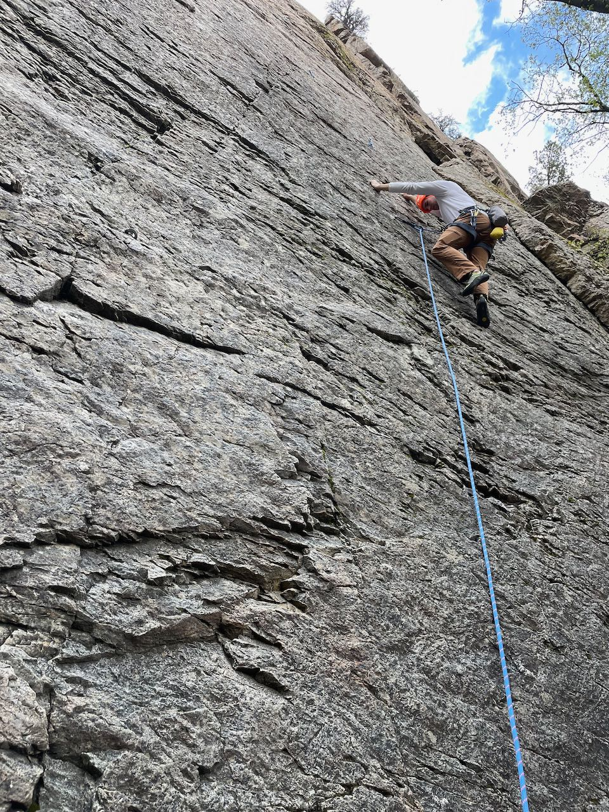
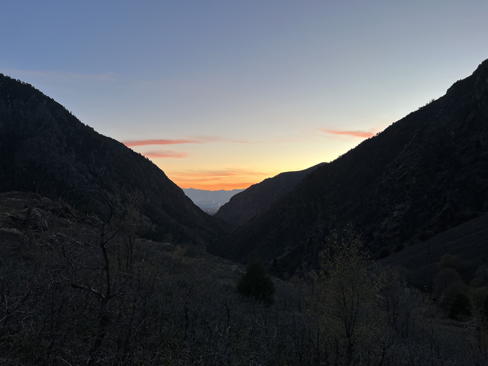

This is a journal of climbs and activities I enjoyed from May 1st-7th, 2022, climbing near Sandy, Utah in the Little and Big Cottonwood Canyons.
Little Cottonwood Canyon has beautiful white granite, while adjacent Big Cottonwood Canyon has a completely different rock type.

I'd met a climber named Jesse at Strange Loop 2021, and he was going to be in Salt Lake City for PyCon at the end of April 2022.
He was hoping to do some climbing in the area but his usual climbing partner wasn't available, so he contacted me.
I was happy to accept the invitation!

I landed in SLC just before noon on Sunday, May 1st, and was picked up from the airport by Jesse and his partner.
The weather wasn't looking great but we decided to drive up Little Cottonwood Canyon (LCC) to see the lay of the land.
The road into the canyon starts at low altitude but quickly gains elevation as you drive further in.
It wasn't long before we saw snow on the ground, then were driving past active ski resorts!
We stopped at a trailhead gleaned from mountainproject, hoping steep rock might be dry despite the snow.
Unfortunately the trail itself was covered in deep soft snow so we bailed and drove back down the canyon.
None of us had packed snow gear!

Near the canyon's mouth we found a parking lot and decided to go for a stroll along a nice trail near the creek.
We identified [Super Slab](https://www.mountainproject.com/area/106044104/super-slab) on the south side the canyon, which looked very wet.

We also saw the ruins of a turbine in what must have been a small hydroelectric power station.
At this point it started to rain so we hightailed it back to the car and grabbed groceries before heading to the place we were staying in the city of Sandy, a five minute drive from the mouth of LCC.

The next day we were blessed by good weather so headed out in search of [Beckey's Wall](https://www.mountainproject.com/route/105740507/beckeys-wall), a 3-pitch 5.7 trad climb.
We found what we thought was the base and roped up, only to find we'd actually started climbing from the bottom of a scrambling route, adding two additional pitches to get to the base of the actual climb!
Jesse led the first pitch of the actual route, and I led the second.
The second pitch follows a relatively low-angle crack in the corner of a right-facing dihedral before going vertical up a juggy section with sporty moves.
This section felt spicy but I handled myself with the help of Jesse's many microcams.
Jesse led the third pitch and we rappeled down to the base before downclimbing the scramble.

We headed back to the car to eat lunch, then relocated to a nearby parking lot to look for [Crescent Crack](https://www.mountainproject.com/route/105740015/crescent-crack), a classic 2-pitch 5.7 trad climb.
I led this route and it was the single hardest trad pitch I'd ever climbed, both physically and especially mentally.
Very enjoyable, though!
My favorite section was the middle, inside a very large chimney with 2-3 jammable cracks.
The crux was a mantle over a boulder near the top with questionable smears to the right hand side.
Due to the length of the route I ran low on gear and had to think hard about what was worth placing where.

After finishing this route I was thoroughly exhausted, and Jesse and I weren't stoked on leading the infamous offwidth chimney directly above the pitch 1 anchors.
We decided to rappel to the ground from there and call it a day.
The rappel was a stretch, even with my 70m rope!



We headed back home and admired the view from our neighborhood.
The mountains surrounding the SLC basin are incredibly beautiful, and I could certainly understand why Mormons chose to settle the place.
The beauty was such that had I grown up here, I might not have become an atheist!

Unfortunately on Tuesday the 3rd we were not blessed by good weather, so went to a local climbing gym and enjoyed a short hike while mulling among ourselves about the [leaked Roe v Wade draft opinion](https://en.wikipedia.org/wiki/Dobbs_v._Jackson_Women%27s_Health_Organization#Leaked_draft_opinion) that had been published the night prior.
The climbing gym was part of the Momentum chain, and I was extremely impressed with their crack climbing facilities.
They had multiple crack sizes, including a chimney and even an overhanging offwidth crack resembling Belly Full of Bad Berries.
I managed to climb a hand jam crack from top to bottom using only hand & foot jams.
As for the hike, it offered beautiful views up a valley south of LCC dusted with snow.

For dinner we enjoyed excellent Mexican food at House of Corn, a restaurant in Sandy that grinds their own corn for their tortillas!
After dinner we went for a hot tub at a friend's place, which had a large & excitable dog.
The friends had spent the day out with a climbing guide at Big Cottonwood Canyon (BCC), so had recommendations for us.

On Wednesday the 4th we again had bad weather, so spent a bunch of time at the climbing gym.
Jesse displayed a particular aptitude for climbing the squeeze chimney.
Then we took a scouting trip up Big Cottonwood Canyon and admired the striking rock formations.

The weather cleared in the evening, so we ventured to a sport climbing crag in Big Cottonwood Canyon called the [Salt Lake Slips](https://www.mountainproject.com/area/105739386/salt-lake-slips).
Here we climbed four easy slab routes in the 5.6-8 range, one right after the other.

It was sunset by the time we hiked out.

On Thursday the 5th we had good weather, but it had rained overnight so the rock was still wet in the morning.
Jesse wanted to lead the first pitch of Crescent Crack, so while waiting for it to dry we climbed [Crack in the Woods](https://www.mountainproject.com/route/105740024/crack-in-the-woods) - a nearby short 5.8 single-pitch trad route.
I found this easier than I thought I would and sewed it up nicely with Jesse's microcams.
The crux was protected by a stuck cam.

The trails to get up to and around the various crags in LCC were pleasant, and the spring foliage was beautiful.

Jesse then dispatched the first pitch of Crescent Crack with only minor faffing, and I (with great difficulty) led the second offwidth pitch.
I was hoping for an opportunity to use my #1 Big Bro, but #3 and #4 BD cams did the job just fine.
Crescent Crack ends in a walk-off from the base of the iconic and aptly-named Coffin Buttress.

For dinner we went to a delicious Vietnamese restaurant called You & I Kitchen.
Their vegetarian dishes were excellent!

On Friday the 6th we again had good weather, and went in search of sport climbing at [The Egg](https://www.mountainproject.com/area/105739527/the-egg), a slab area in LCC.
We ran into a number of navigational difficulties, scrambling up the wrong gulley and failing to identify the wall even after standing right in front of it for half an hour.
Slab routes have a curious foreshortening visual effect which makes them look not as long as they are, and we were searching for a route infamous for being long enough for people to [lower off the end of their rope](http://publications.americanalpineclub.org/articles/13201214411)!
We eventually realized we really were in the right place, and I led a nerve-fraying run-out 5.7 friction slab sport route called [Just Say No to Crack](https://www.mountainproject.com/route/105740450/just-say-no-to-crack).
I was very glad I'd brought my stick-clip.
After that experience we decided we'd had enough granite friction slab climbing for a while and headed back to the car.

For the afternoon we'd originally hoped to climb [Outside Corner](https://www.mountainproject.com/route/105740009/outside-corner), a spectacular 3-pitch 5.7 trad climb in BCC.
However, after the frustration of the morning we elected to climb some chill single-pitch sport routes in the BCC instead.
We started out at [Dogwood Crag](https://www.mountainproject.com/area/105739359/dogwood-crag), a very slippery rock climbing wall directly above a creek.

After climbing two routes there that did little to assuage our slab-frayed nerves, we drove further up the canyon to [Ambush Wall Lower](https://www.mountainproject.com/area/105990056/ambush-wall-lower) and finished the day by ticking two easy juggy sport climbs on much superior rock.

Saturday the 7th was to be my last day in the area, and I had enough time in the morning to do one climb before my flight.
I elected to try to climb [The Coffin](https://www.mountainproject.com/route/105740048/the-coffin), a classic 5.9 finger crack splitting the previously-seen Coffin Buttress and surely the most difficult trad route I'd ever attempted.
I had the feeling of marching off to battle that morning, having agonized over gear selection the night prior.
It went off without a hitch!
The most difficult section was just getting up to the crack itself from the bottom, but after that I had very little trouble.
I sewed it up and was at the anchors before I knew it!

After a quick shower Jesse dropped me off at the airport for the flight back to Atlanta.
I had a tremendous time and would certainly return!
This trip reinvigorated my flagging love for rock climbing.
